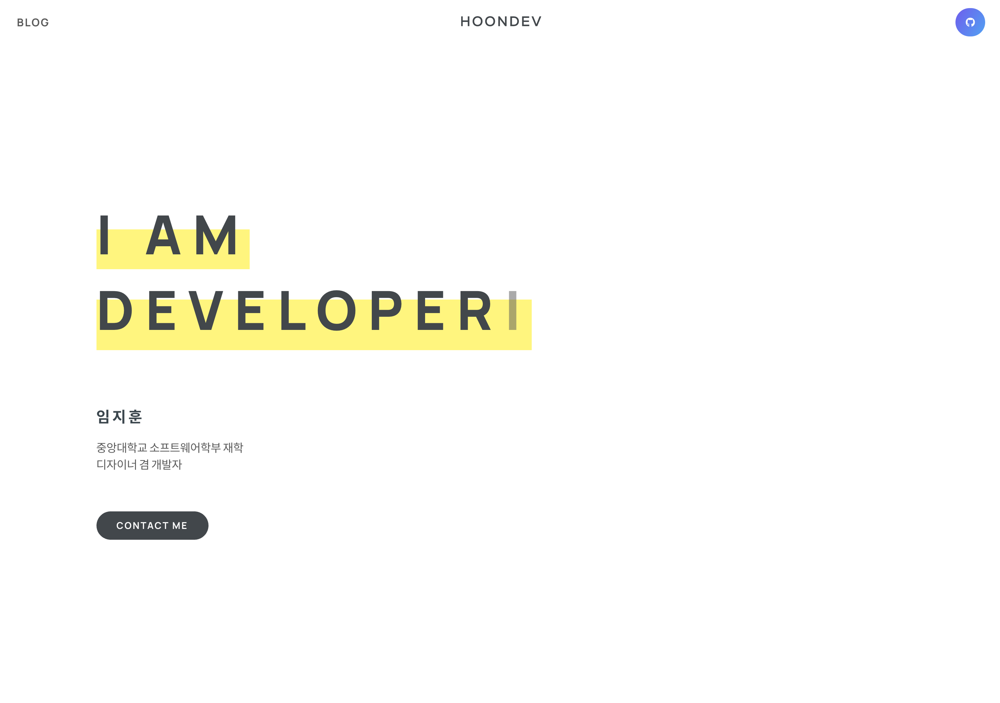

[![Stargazers][stars-shield]][stars-url]
[![Issues][issues-shield]][issues-url]
[![MIT License][license-shield]][license-url]

 

<!-- PROJECT LOGO -->

  <h3 align="center">HOONDEV.com</h3>
  

    <a href="https://hoondev.com">View Site</a>
  

<!-- TABLE OF CONTENTS -->

  
<h2 style="display: inline-block">Table of Contents</h2>

  <ol>
    <li>
      <a href="#about-the-project">About The Project</a>
      <ul>
        <li><a href="#built-with">Built With</a></li>
      </ul>
    </li>
    <li><a href="#roadmap">Roadmap</a></li>
    <li><a href="#contact">Contact</a></li>
  </ol>

<!-- ABOUT THE PROJECT -->
## About The Project

This project is made just only for `my portfolio site`.

It was created when learning React for the first time, so it needs a lot of modifications and enhancements. I am planning to improve it gradually.

### Built With

* [React](https://github.com/facebook/react)

<!-- ROADMAP -->
## Roadmap

See the [open issues](https://github.com/hoondeveloper/hoondev/issues) for a list of proposed features.

<!-- CONTACT -->
## Contact

Ji Hoon Lim - [@hoondeveloper](https://twitter.com/hoondeveloper) - hoonskyn9@gmail.com

<!-- ACKNOWLEDGEMENTS -->
<!--
## Acknowledgements

* 
* 
* 

-->

<!-- MARKDOWN LINKS & IMAGES -->
<!-- https://www.markdownguide.org/basic-syntax/#reference-style-links -->
[stars-shield]: https://img.shields.io/github/stars/hoondeveloper/hoondev.svg?style=for-the-badge
[stars-url]: https://github.com/hoondeveloper/hoondev/stargazers
[issues-shield]: https://img.shields.io/github/issues/hoondeveloper/hoondev.svg?style=for-the-badge
[issues-url]: https://github.com/hoondeveloper/hoondev/issues
[license-shield]: https://img.shields.io/github/license/hoondeveloper/hoondev.svg?style=for-the-badge
[license-url]: https://github.com/hoondeveloper/hoondev/blob/master/LICENSE.txt